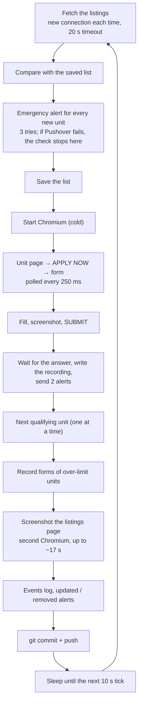
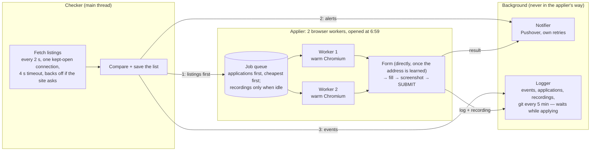
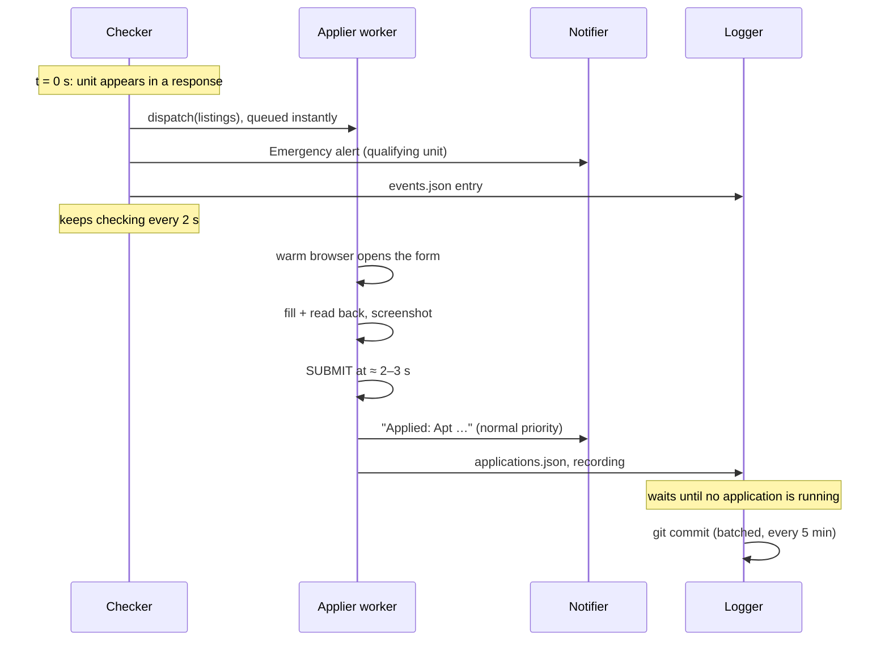

# Architecture: before and after Phase 1

The goal hasn't changed: **apply to every unit at or under `AUTO_APPLY_MAX_RENT`
as soon as it appears.** The watcher's own logs show why speed decides it:
the cheap units have been gone (all 3 applications taken) **15–45 seconds**
after appearing, the fastest within 12–27 s of being seen. Phase 1 rebuilds
the watcher so that applying always comes first, and nothing else (alerts,
logging, git) can delay it or break it.

## Before: one loop did everything, one step at a time

Every 10 seconds, a single thread ran this, in this order. Nothing checked
for new units until the last step was done.

What that cost a qualifying unit (posting → SUBMIT, typical case): **≈ 8.7 s**,
of which ~6 s was waiting for the next check, the alert, the browser start
and the saves. On top of that:

- A Pushover outage stopped auto-apply completely, every check.
- After a new unit, checking paused for roughly 8–20 s.
- A second cheap unit waited for the first one's alerts and recording.

## After: four workers, applying first

One check now goes like this:

1. The **checker** fetches the listings over its kept-open connection and
   saves the list.
2. It hands the listings to the **applier**, before any alert is queued.
   `dispatch()` only queues work: a qualifying unit is waiting for a browser
   within microseconds, and the checker is free to check again 2 s later.
3. Only then are the alerts queued for the **notifier**: Emergency for a
   qualifying unit, normal for one that isn't. Events are queued for the
   **logger**.
4. A free **applier worker** opens the unit's form in a browser that has been
   open since 6:59 with the site already loaded. It fills the form, checks
   every field, screenshots it and presses SUBMIT. Two qualifying units are
   applied to at the same time, one per browser.
5. The result goes to the **notifier** (one message: success, or a separate
   failure message) and to the **logger** (applications log, redacted
   recording). The logger waits while any application is running, and
   commits to git every 5 minutes instead of after every change.

## What changed, and what it buys

| Critique item (from the review) | Before | After |
| --- | --- | --- |
| **High:** a Pushover failure stops auto-apply | The alert came first and could fail the whole check | The applier gets the listings first; alerts run on the notifier with their own retries. Bad Pushover keys no longer stop the watcher: it runs, and the job is marked failed at the end |
| **High:** detection waits up to 10 s | Every 10 s, a new connection each time, 20 s timeout | Every 2 s over one kept-open connection, 4 s timeout. It backs off only if the site asks (429/403, honoring Retry-After) and returns to 2 s gradually; plain errors are retried quickly and forgotten on the first good answer |
| **High:** everything is serial | Applying, recordings, screenshots and git all paused checking; units applied to one at a time | The checker never pauses. 2 applier workers apply in parallel. All logging and alerts happen in the background. Recordings of over-limit forms run only when no application is |
| **Medium:** each application starts cold | Chromium launched per check; the site loaded from nothing | Each worker opens Chromium at 6:59, loads the site once and keeps it warm (reloads every 4 min when idle) |
| **Medium:** three page steps before the form | Unit page → APPLY NOW → form, every time | The form's address is learned from the first APPLY NOW. A recording then checks that opening it directly shows the right apartment, and from then on applications go straight to the form. Any failure falls back to the unit page |
| **Medium:** waits poll on a timer | APPLY NOW and the form checked every 250 ms | APPLY NOW is caught on the frame the page draws it (`wait_for_function`, `polling="raf"`); the form search runs every 50 ms |

**Removed:** the listings-page screenshot after every new unit (a second
browser, up to ~17 s of paused checking; the `screenshots/` folder is gone),
the "listing updated" and "no longer listed" alerts (still in `events.json`),
the quiet "After SUBMIT" second alert, the per-change git commits and the
log line on every check (now one status line a minute).

**Alerts now**

| Alert | When | Priority |
| --- | --- | --- |
| Qualifying StuyTown unit – auto-applying now | A new unit at or under your rent limit (and income) | **2 Emergency**, the only one that breaks through Do Not Disturb |
| New StuyTown unit (doesn't qualify) | Any other new unit | 0 normal |
| Applied: Apt … | The site confirmed the application (filled form attached) | 0 normal |
| Auto-apply failed / unconfirmed: Apt … | Anything else (page attached) | 0 normal |

**Expected time to SUBMIT** (posting → request sent, typical case):
≈ 8.7 s before, about **2–3 s** now. That's 1 s average wait for the next
check, about 0.1 s for the listings, then the form in a warm browser. On the
fake copy of the site the applier submits about 1.0 s after being handed a
unit, going straight to the form. The real site's page times will come from
the first recordings in `data/apply_runs/`.

## Not in Phase 1

Sending SUBMIT's request directly, without a browser, could get to about 1 s.
It needs to see what the real SUBMIT request looks like first, and the
recordings capture exactly that. A wrong direct request can't be taken
back, since the site allows one application per apartment, so it waits for
real data.

## Threads, and why not asyncio

Playwright's objects belong to the thread that created them, and the
form-filling code is synchronous and well tested. So each applier worker is
a thread that owns its own browser. The checker, the notifier and the
logger are plain threads joined by queues. Every cross-thread hand-off is a
queue put that never blocks, and every background job runs in its own
try/except, so a failure there can't reach the checker or the applier.
